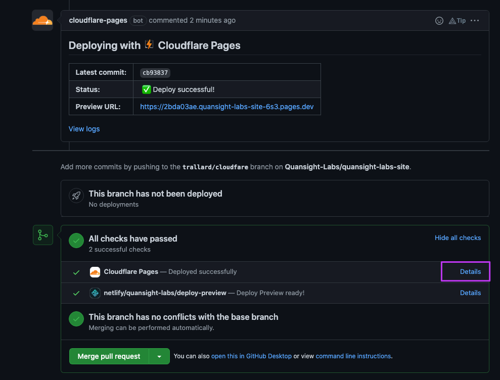

# Quansight Labs Site

## Creating new posts

Use either reStructuredText, Markdown or Jupyter Notebooks. To create an empty post:
```
$ nikola new_post -f markdown  # default is .rst if not specified
```

Note that for Jupyter notebook posts the post metadata (title, author, slug, date) goes in the notebook metadata as documented [here](https://getnikola.com/handbook.html#jupyter-notebook-metadata). Jupyter Lab does not have a metadata editor yet - either use Jupyter notebook, install https://github.com/yuvipanda/jupyterlab-nbmetadata (although that did not work in a first test), or edit the metadata by hand.

To not show the whole post but only the first bit and then `read more ...`, use `<!-- TEASER_END -->` (either in plain Markdown or in a Markdown cell in a notebook).

## Build information

To set up a development environment: in a new conda env or virtualenv:
```
$ pip install -r requirements.txt
```

The configuration file for the site is ``conf.py``.

To build the site, and have it auto-update when you edit content:

    nikola auto


## Deployment

Submit pull requests first, those get run on [Netlify](https://quansight-labs.netlify.app/) and you can see a build preview by clicking on the `details` link at the bottom.


