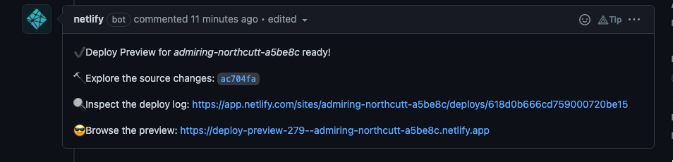
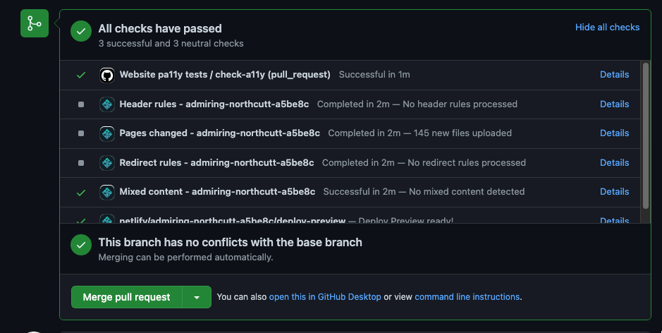

# Quansight Labs Site

[](https://github.com/Quansight-Labs/quansight-labs-site/actions/workflows/deploy.yml)

## Creating new posts

Use either reStructuredText, Markdown or Jupyter Notebooks. To create an empty post:

```sh
$ nikola new_post -f markdown  # default is .rst if not specified
```

Note that for Jupyter notebook posts the post metadata (title, author, slug, date) goes in the notebook metadata as documented [here](https://getnikola.com/handbook.html#jupyter-notebook-metadata). Jupyter Lab does not have a metadata editor yet - either use Jupyter notebook, install <https://github.com/yuvipanda/jupyterlab-nbmetadata> (although that did not work in a first test), or edit the metadata by hand.

To not show the whole post but only the first bit and then `read more ...`, use `<!-- TEASER_END -->` (either in plain Markdown or in a Markdown cell in a notebook).

## :calendar: Scheduling a post - internal content calendar

The future post schedule is available as a [Google Spreadsheet accessible only
to Quansight
Employees](https://docs.google.com/spreadsheets/d/1UyKeiM0elXKrhY5BeG3CHB13ydeqUjnv02oyN1NrKqk/edit#gid=0),
you can use it to lookup next free spot.

The website rebuilds itself everyday (look into the GitHub action Cron), thus if
you set the date on the metadata of your post and merge the Pull-Request, the
post will be published on given day.

The PR preview system does show Future blog post, so no need to put a fake date when issuing a PR.

## :construction_worker: Build information

:snake: Note that Netlify uses Python `3.8` to build and deploy the site.

To set up a development environment: in a new conda env or virtualenv:

```sh
$ pip install -r requirements.txt
```

Configuration file for the site is ``conf.py``.

To build the site, and have it auto-update when you edit content:

    nikola auto

## :rocket: Deployment

Once you submit a Pull Request a build of the site will be triggered on Netlify. The Netlify bot will add a comment to your Pull Request with the link to the preview URL.



If the build fails or you need to see more details about it click on the **Show all checks** link in the checks section and then click on **Details** to expand the list of checks and their full logs.



:alarm_clock: In addition to automatic builds on merge requests, we use GitHub actions to trigger an automatic build of the site everyday at 10:37 UTC. So if you want to "schedule" posts the best way is to make sure the date in the post preamble is a couple of hours before the scheduled time:

```yml
date: 2021-10-07 10:00:00 UTC-07:00
```
